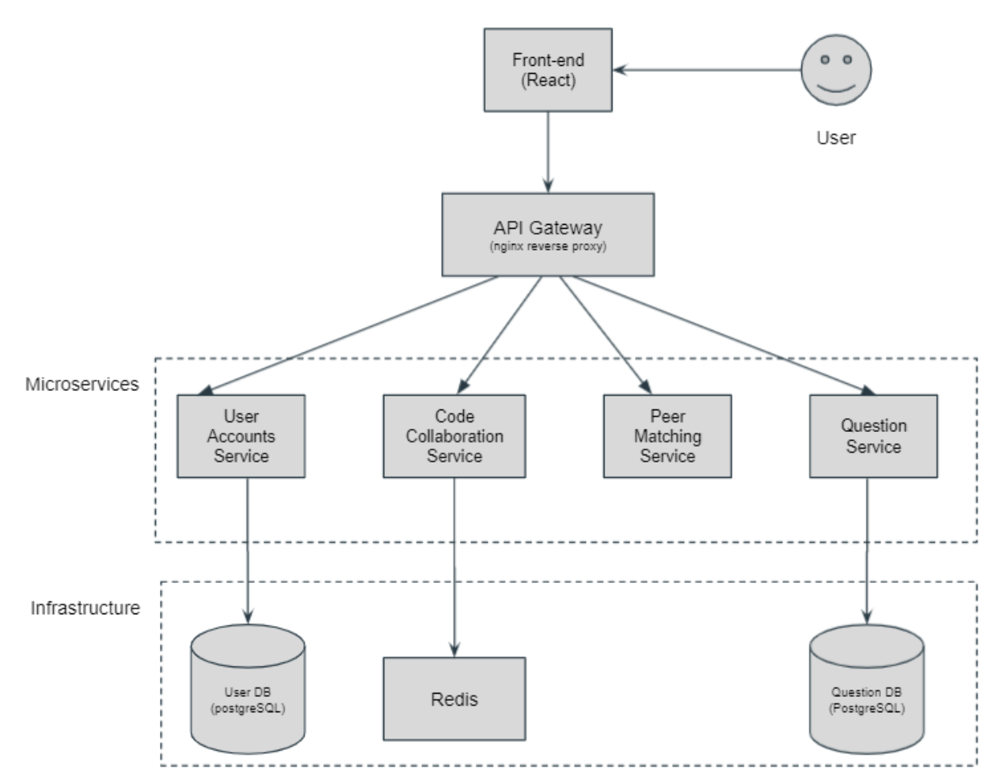

# CS3219: PeerPrep Group 11

## Group Members
| Member             | Student ID |
|--------------------|------------|
| Goh Jun Wei        | A0201970M  |
| Low En Hao         | A0200239U  |
| Murugesan Karthika | A0191135L  |
| Lee Wei Yi, Samuel | A0202032H  |

## Architecture

## Functional Requirements (FR)

### F1. Authentication
F1.1 Users should be able to log in with email and password into the system.  
F1.2 Users should be able to sign up with an username, email address, and password.  
F1.3 Users should be able to reset their passwords.  
F1.4 Users should be able to log out once they’re done with their session.  
F1.5 The system should be able to differentiate admins and users.

### F2. Code Collaboration 
F2.1 Users should be able to enter the solution to the text field in near-real-time for both users.   
F2.2 Users should be able to view the coding question.  
F2.3 Users should be able to instant message one another.   
F2.4 Users should be able to exit code collaboration once his/her partner is done and be sent back to the question difficulty selection page.   
F2.5 Users should be able to re-connect to the collaboration room if either user is disconnected.  
F2.6 Users should be able see their written codes even after refreshing the page by storing these data in the cache.  

### F3. Peer Matching System
F3.1 Users should be able to select the difficulty of the question. (Easy, Medium or Hard)   
F3.2 Users are matched with another user based on their selected difficulty level of Easy, Medium, or Hard.  
F3.3 Users would be timed out after 30 seconds if not successfully matched and sent back to the difficulty selection page. 

### F4. Programming Question System
F4.1 Users should be able to have their questions selected randomly.  
F4.2 Users should be attempting questions that they have not done before.  
F4.3 The programming questions should have an associated proficiency level of Easy, Medium, and Hard.   
F4.4 The programming questions should have an associated category of programming questions such as Data Structures, Algorithms, Runtime associated with it.  
F4.5 Admin should be able to add questions to the question pool  
F4.6 Admin should be able to delete questions from the question pool  
F4.7 Admin should be able to edit questions from the question pool  

### F5. Profile
F5.1 Users should be able to view their personal profile information.  
F5.2 Users should be able to view past attempted questions.   
F5.3 Users should be able to change their username and password.  

## Non-Functional Requirements (NFR)
### NFR1. Security
NFR1.1 Passwords should have at least 8 characters, with a combination of lower and upper cases.  
NFR1.2 Users should be authenticated using JWToken  
NFR1.3 Passwords should be hashed (SHA-256) before storing in the database

### NFR2. Scalability 
NFR2.1 The system should be able to scale up with the number of users and handle the load of up to 300 users at any one time. 

### NFR3. Usability
NFR3.1 Users should be able to understand and get started on using the application within 5 minutes.  
NFR3.2 Logged in users should not take more than three clicks to select their question and get matched  
NFR3.3 Users should receive meaningful alerts in the application flow to aid user experience. 